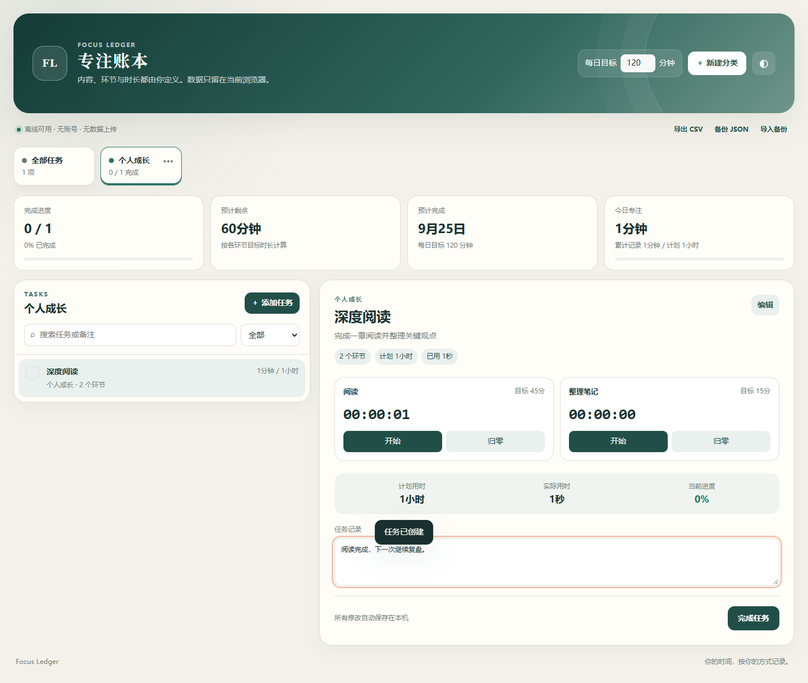

# Focus Ledger · 专注账本

一个无需注册、完全由使用者定义内容与节奏的本地专注计时器。

**在线使用：** [https://josephsun1854.github.io/focus-ledger/](https://josephsun1854.github.io/focus-ledger/)

## 为什么做它

这个项目最初来自一款为特定备考课程设计的计时器。课程名称、学习环节和时长都写死在页面里，很好用，但只能服务一种场景。

Focus Ledger 保留了原型中最有价值的部分——分环节计时、目标与实际用时比较、进度预测和数据导出——同时删除全部预设课程与固定时长。无论是阅读、训练、写作、编程还是个人项目，都可以建立自己的分类、任务和节奏。

## 功能

- 自定义分类、任务、计时环节和目标时长
- 多个环节独立开始、暂停、归零或手动校正
- 显示任务进度、预计剩余时间、预计完成日期和今日专注时间
- 按任务状态筛选并搜索任务或笔记
- 自动保存在浏览器本机，无需账号和后端服务
- 导出 CSV 记录，或使用 JSON 完整备份与恢复
- 响应式布局、明暗主题和键盘可访问的表单控件
- 纯静态页面，可离线打开，也可直接部署到 GitHub Pages

## 使用方法

直接打开在线页面即可。第一次使用时：

1. 新建一个分类；
2. 添加任务；
3. 为任务添加一个或多个计时环节，并自行填写目标分钟数；
4. 开始计时，或直接在计时框中填写实际用时。

如果希望离线使用，也可以下载本仓库并直接打开 `index.html`。

## 数据与隐私

所有内容保存在浏览器的 `localStorage` 中，不会发送到服务器。清除浏览器网站数据前，建议先使用“备份 JSON”。换浏览器或换设备时，可导入该 JSON 恢复数据。

## 技术说明

项目仅使用原生 HTML、CSS 和 JavaScript，无构建步骤、无第三方依赖。核心文件为：

- `index.html`：页面结构与对话框
- `styles.css`：响应式界面与明暗主题
- `app.js`：数据模型、计时、导入导出和本地存储

## License

[MIT](LICENSE)

---

Built by [JosephSun1854](https://github.com/JosephSun1854).
